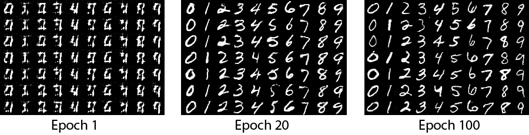
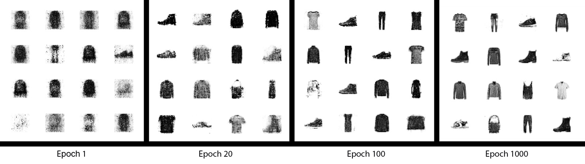

# FaceGAN

In this project, the goal is to explore the workings of Generative Adversarial Networks, and attempt to expand existing models to work with custom datasets.

Using preexisting models presented problems about how to make a model that accepts 28x28 pixel black and white images instead accept 32x32 pixel color images, or 100x100 black and white images. This led me to learn a lot about how GANs work and how the size and type of input shapes the network and the impact these changes have on the results the network produces.

This was the final project of the course COSC 790 - Digital Sound and Image Processing at Wake Forest University during the Spring 2019 semester.

## Existing Models Used in This Project

This project uses little original code. Instead, it uses models found online and attempts to adapt them to receive images from a customized dataset as input. 

MNIST images were generated from the model by Luke de Oliveira in the Keras documentation: <https://keras.io/examples/mnist_acgan/> (Also accessible via the repository https://github.com/lukedeo/keras-acgan)

Color CIFAR images were generated from the model in this repository: https://github.com/King-Of-Knights/Keras-ACGAN-CIFAR10

The black and white CIFAR, Fashion-MNIST, and face images were generated using this model from Datacamp, written by Stefan Hosein: https://www.datacamp.com/community/tutorials/generative-adversarial-networks

